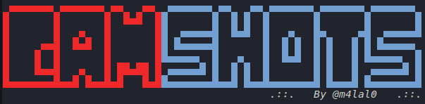
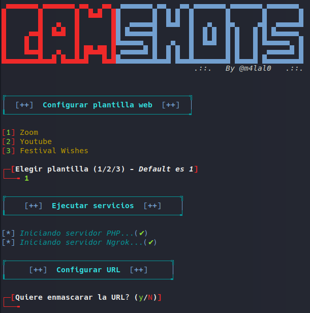

# CamShots
[](#)
[](#)
[](#)
[](#)
[](#)
[](#)



Obtén fotos de la cámara frontal del teléfono o de la cámara web de la PC del objetivo enviando un enlace.

## Qué es CamShots?
CamShots es una técnica para tomar fotos de la cámara del teléfono del objetivo o la cámara web del PC. CamShots aloja un sitio web falso en el servidor PHP construido y utiliza ngrok para generar un enlace que vamos a remitir a la victima, que puede ser utilizado en Internet. El sitio web pide permiso de la cámara y si el objetivo lo permite, esta herramienta toma fotos del dispositivo de destino.

## Caracteristicas
En esta herramienta se he añadido tres plantillas de página web automática para obtener imagenes a través de la camara del objetivo:

+ Zoom Meeting
+ Youtube
+ Festival Wishing

Para la plantilla de Youtube simplemente introduzca el ID de algun video a reproducir. Para la plantilla de Wishing introduzca el nombre de un festival.

También cuenta con el enmascaramiento de la URL si el usuario asi lo requiere.

Cuando el objetivo entre se mostrará información acerca de su dirección IP.

## Instalación y uso
```
git clone https://github.com/m4lal0/camShots
cd camShots; chmod +x camShots.sh
./camShots.sh
```

1- Al ejecutar el script, este comprueba si existen ciertas herramientas que necesita para su ejecución correcta.

2- Después preguntará por la plantilla a usar.

3- Preguntará si quiere enmascarar la URL que se le proporcionará al objetivo.

4- Se envia la URL a la victima y a esperar para capturar su dirección IP y las imagenes que tomara con su camara.



## Descargo de responsabilidad
El desarrollador no asume ninguna responsabilidad y no es responsable de cualquier mal uso o daño causado por este programa.